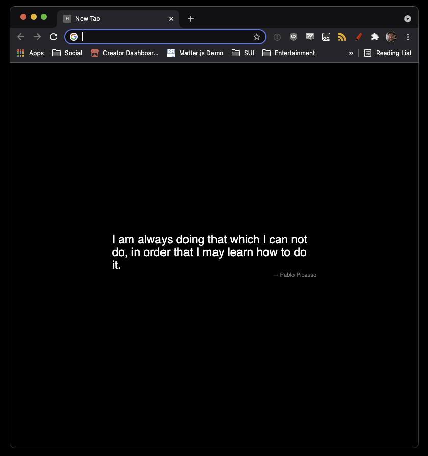

# Happy Tab



## Why
On Friday Oct 29th 2021 Google broke its brilliant design UX and started showing advertisements on the google landing page and the new Chrome tab window.

I'm an 'intellectual worker'. My 'mind space' needs to be as free and clear of distraction as possible.

## What

- Create a 'new tab' window that I can control and customize to my liking (blank page with a random quote for now, maybe more later)

If there is interest, I'll look into uploading to the Google Store, but there are already several in existence if one is looking for an easy solution.

Recommend using this as a template project for creating your _own_ extension to customize.

It is written in typescript with only the 'chrome type' and typescript itself as a dependency.

## Alternatives
- Use Chromium
- Use Brave

## Build

```
$ npm run build
```

## Thanks
Quotes from: https://gist.github.com/JakubPetriska/060958fd744ca34f099e947cd080b540